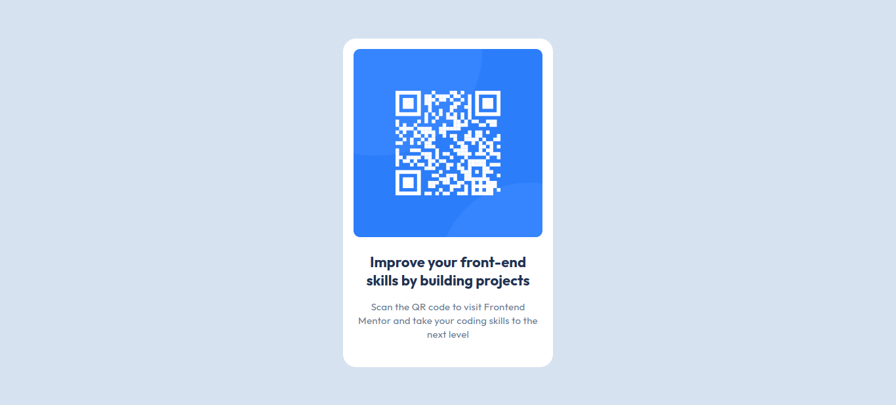

# Frontend Mentor - QR code component solution

This is a solution to the [QR code component challenge on Frontend Mentor](https://www.frontendmentor.io/challenges/qr-code-component-iux_sIO_H). Frontend Mentor challenges help you improve your coding skills by building realistic projects. 

## Table of contents

- [Overview](#overview)
  - [Screenshot](#screenshot)
  - [Links](#links)
- [My process](#my-process)
  - [Built with](#built-with)
  - [What I learned](#what-i-learned)
  - [Continued development](#continued-development)
  - [Useful resources](#useful-resources)
- [Author](#author)
- [Acknowledgments](#acknowledgments)

## Overview

### Screenshot



### Links

- Solution URL: [GitHub repository](https://github.com/welpmoz/QR-website)
- Live Site URL: [Live site](https://welpmoz.github.io/QR-website/)

## My process

### Built with

- Semantic HTML5 markup
- CSS custom properties
- Flexbox

### What I learned

I learn how integrate google fonts in styles

```css
@import url('https://fonts.googleapis.com/css2?family=Outfit:wght@100..900&display=swap');
```


## Author

- Github - [Roswell Jaime](https://github.com/welpmoz)
- Frontend Mentor - [@welpmoz](https://www.frontendmentor.io/profile/welpmoz)

## Acknowledgments

I greatly appreciate the work done by the Frontend Mentor community. Their challenges are diverse and well-suited for developers at all levels. Additionally, I'm grateful for the inclusion of Figma as a useful resource.